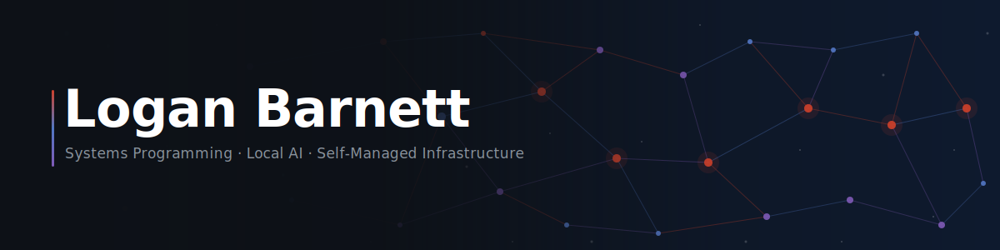

#+title: Logan Barnett
#+language: en

#+begin_export html

 

 

#+end_export

I write tools that run local AI workloads and tools that keep a self-managed
home network running — and the two concerns overlap more than you'd expect.
Most of it is Rust, configured with Nix, edited in Emacs.

* COMMENT Maintenance

This org-mode file is the authoritative source for the README content.
~README.md~ is generated for GitHub's profile README feature, which only supports
markdown.  Do not edit ~README.md~ directly.

Regenerate it via:

#+begin_src sh
just build
#+end_src

* Local ML Infrastructure

Running inference at home across a mix of machines means dealing with routing,
resource contention, and visibility. This stack handles that without reaching
for any cloud services.

- [[https://github.com/LoganBarnett/garage-queue][garage-queue]] @@html:@@ — A capability-aware work queue. Producers submit payloads;
  the queue routes each item to a worker that advertises the right hardware
  and software capabilities to handle it. The queue itself has no knowledge
  of any particular workload — that lives entirely in configuration. Can be
  configured to route Ollama inference requests to machines with sufficient
  VRAM and the right models loaded. This is the central dispatcher for the
  whole stack.

- [[https://github.com/LoganBarnett/proc-siding][proc-siding]] @@html:@@ — Monitors GPU utilization and pauses a watched workload when
  it detects sustained external pressure. Keeps background inference jobs from
  fighting over the GPU when the machine is in active use.

- [[https://github.com/LoganBarnett/metalps][metalps]] @@html:@@ — ~ps~, but for the GPU. Shows per-process Metal utilization, VRAM
  footprint, and device-level statistics on macOS. The visibility layer that
  makes the other two possible to reason about.

* Self-Managed Home Network

This is less "personal cloud" (file sync, productivity apps) and more owning
and operating the full stack of a small network: identity, DNS, configuration,
and automated remediation — all declarative, all reproducible.

- [[https://github.com/LoganBarnett/dotfiles][dotfiles]] — Despite the name, this is a Nix configuration for an entire
  network of machines. Every host is defined as code and deployed with a
  custom copy-closure tool. The foundation everything else builds on.

- [[https://github.com/LoganBarnett/nix-hapi][nix-hapi]] @@html:@@ — Declarative API management via Nix expressions. Describe the
  desired state of external services as pure Nix, and nix-hapi reconciles live
  state to match.  Stateless — no state file, always diffs against what's live.
  - [[https://github.com/LoganBarnett/nix-hapi-provider-ldap][nix-hapi-provider-ldap]] — Reconciles LDAP directories (OpenLDAP, 389ds, etc.)
    declaratively.
  - [[https://github.com/LoganBarnett/nix-hapi-provider-porkbun][nix-hapi-provider-porkbun]] — Manages DNS records via the Porkbun API.
  - [[https://github.com/LoganBarnett/nix-hapi-provider-aruba-cx][nix-hapi-provider-aruba-cx]] — Manages Aruba CX network switches.

- [[https://github.com/LoganBarnett/dns-smart-block][dns-smart-block]] — Network-level domain blocking informed by machine
  learning classification. Sits at the DNS layer so it applies to every
  device on the network.

- [[https://github.com/LoganBarnett/sonify-health][sonify-health]] @@html:@@ — Turns infrastructure health into ambient sound.  Each
  machine self-reports via percussive heartbeat boops and a continuous stress
  drone — a Star Trek bridge feel that encodes real meaning into peripheral
  awareness without requiring visual attention.

- [[https://github.com/LoganBarnett/sytter][sytter]] — IFTTT for a host. Watch for a runaway process and kill it;
  trigger a script when a USB device is plugged in; turn off Bluetooth when
  the system sleeps. Any observable host event can trigger any action you
  configure.

* Also Worth Knowing

- [[https://github.com/LoganBarnett/monad-oxide][monad-oxide]] — A Ruby port of Rust's =Result= and =Option= types. Bringing
  explicit error handling to a language that throws everything.

* Outside of Code

Tabletop gaming (Warhammer 40K, D&D world-building), 3D printing and OpenSCAD
modeling, and tinkering with Gridfinity storage systems.
